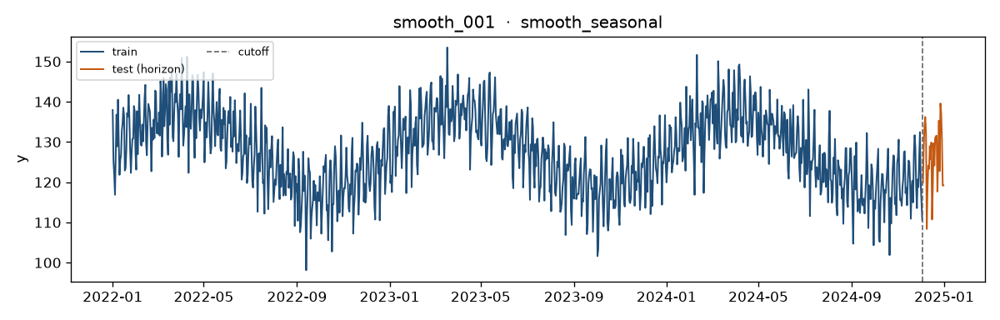
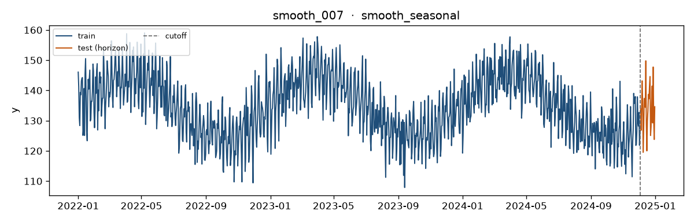
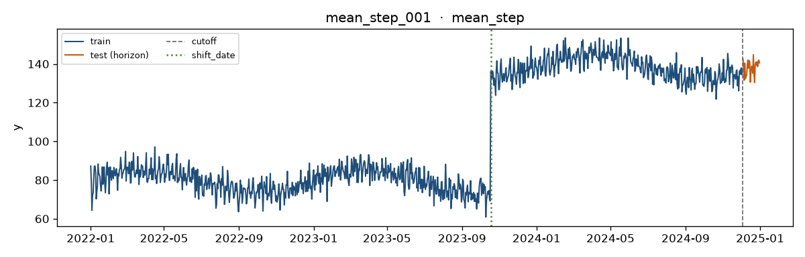
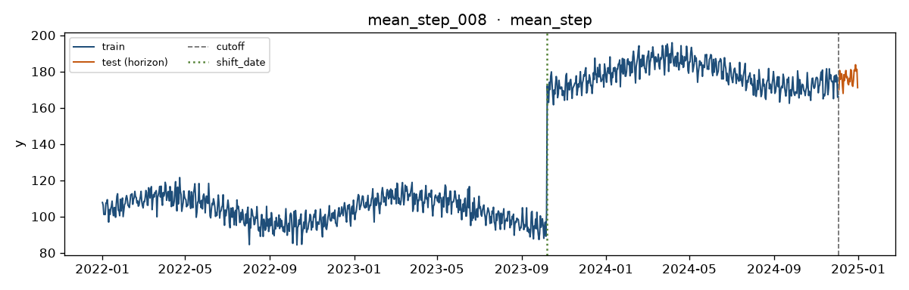
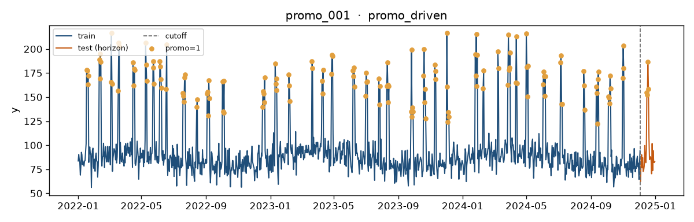
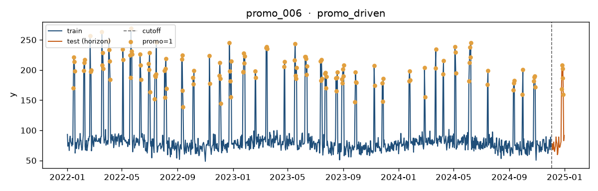
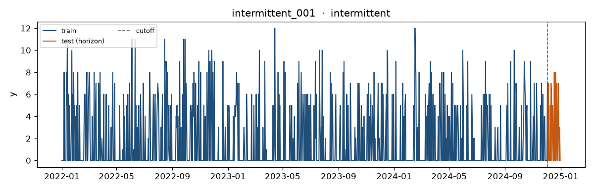
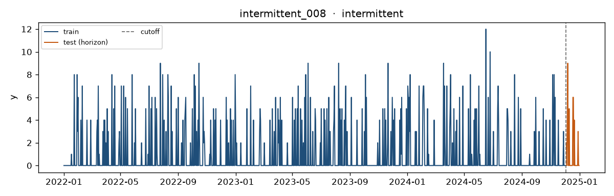
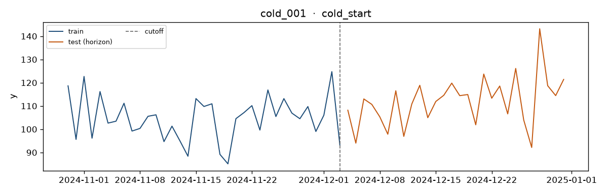
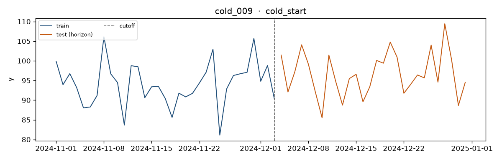

# Synthetic panel review

- Cutoff: `2024-12-03` · Horizon: `28` · Seed: `42`
- Series: `50` · Rows: `44583`

Primary view: [`REVIEW.html`](REVIEW.html) (open in browser).

## Manual checklist

- [ ] Seasonality visible on smooth
- [ ] Clear permanent mean jump on mean_step (vline at shift_date)
- [ ] Promo spikes align with promo flag
- [ ] Intermittent looks sparse/discrete
- [ ] Cold-start history is obviously short

## Gold checks

| Check | Pass | Detail |
|-------|------|--------|
| `unique_series_ds` | yes | dupes=0 |
| `cutoff_json_matches_column` | yes | cutoff=2024-12-03 |
| `horizon_matches_config` | yes | horizon=28 |
| `regime_count::smooth_seasonal` | yes | n_series=10 |
| `regime_count::mean_step` | yes | n_series=10 |
| `regime_count::promo_driven` | yes | n_series=10 |
| `regime_count::intermittent` | yes | n_series=10 |
| `regime_count::cold_start` | yes | n_series=10 |
| `no_daily_gaps` | yes | gap_series=[] |
| `post_cutoff_horizon_rows` | yes | min=28 max=28 |
| `promo_zero::smooth_seasonal` | yes | promo_sum=0 |
| `promo_zero::mean_step` | yes | promo_sum=0 |
| `promo_zero::intermittent` | yes | promo_sum=0 |
| `smooth_seasonal::acf7` | yes | mean_acf7=0.719 |
| `smooth_seasonal::zero_rate` | yes | max_zero_rate=0.000 |
| `mean_step::mean_jump` | yes | all_ok |
| `promo_driven::lift_and_rate` | yes | all_ok |
| `intermittent::discrete_sparse` | yes | all_ok |
| `cold_start::train_length` | yes | all_ok |

## Exemplars

### Smooth seasonal — `smooth_001`

- Expected later winner: **Seasonal Naive / ETS**
- Look for: Clear weekly seasonality; stable mean; low zeros.
- n_train_days=1068; parent_dgp=smooth
- 

### Smooth seasonal — `smooth_007`

- Expected later winner: **Seasonal Naive / ETS**
- Look for: Clear weekly seasonality; stable mean; low zeros.
- n_train_days=1068; parent_dgp=smooth
- 

### Mean step (structural break) — `mean_step_001`

- Expected later winner: **ETS / LightGBM**
- Look for: Permanent jump in series mean at shift_date; SN will lag after the break.
- n_train_days=1068; parent_dgp=smooth
- 

### Mean step (structural break) — `mean_step_008`

- Expected later winner: **ETS / LightGBM**
- Look for: Permanent jump in series mean at shift_date; SN will lag after the break.
- n_train_days=1068; parent_dgp=smooth
- 

### Promo / covariate-driven — `promo_001`

- Expected later winner: **LightGBM**
- Look for: Spikes aligned with promo=1; promo present in test horizon.
- n_train_days=1068; parent_dgp=promo
- 

### Promo / covariate-driven — `promo_006`

- Expected later winner: **LightGBM**
- Look for: Spikes aligned with promo=1; promo present in test horizon.
- n_train_days=1068; parent_dgp=promo
- 

### Intermittent discrete demand — `intermittent_001`

- Expected later winner: **Metric drama; Chronos vs local stats**
- Look for: Many exact zeros; integer bursts; MAPE-unfriendly.
- n_train_days=1068; parent_dgp=intermittent
- 

### Intermittent discrete demand — `intermittent_008`

- Expected later winner: **Metric drama; Chronos vs local stats**
- Look for: Many exact zeros; integer bursts; MAPE-unfriendly.
- n_train_days=1068; parent_dgp=intermittent
- 

### Cold start / short history — `cold_001`

- Expected later winner: **Chronos-Bolt**
- Look for: Only ~30–60 train days before cutoff.
- n_train_days=35; parent_dgp=smooth
- 

### Cold start / short history — `cold_009`

- Expected later winner: **Chronos-Bolt**
- Look for: Only ~30–60 train days before cutoff.
- n_train_days=33; parent_dgp=smooth
- 

